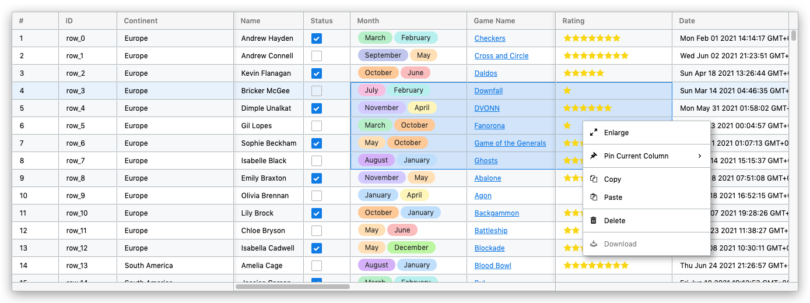

<p align="center">
    <h1 align="center">visual-grid</h1>
    <p align="center">JavaScript Data Grid</p>
    <p align="center">
        <a href="https://github.com/visualjs/grid/actions/workflows/test.yml" title="Test Status">
            
        </a>
        <a href="https://github.com/visualjs/grid/actions/workflows/publish.yml" title="Release Status">
            
        </a>
        <a href="https://www.npmjs.com/package/visual-grid" title="version">
            
        </a>
        <a href="https://github.com/visualjs/grid/issues" title="issues">
            
        </a>
        <!-- <a href="https://github.com/visualjs/grid" title="stars">
            
        </a>
        <a href="https://github.com/visualjs/grid" title="forks">
            
        </a> -->
        <a href="./LICENSE" title="license">
            
        </a>
    </p>
</p>

<p align="center">
    
</p>

## Install

```
npm i @visualjs/grid
```

or using yarn

```
yarn add @visualjs/grid
```

## Qucik Usage

Please see

- [example/full-example](./example/full-example.ts)
- [example/interactive-example](./example/interactive-example.ts)

## Available icons

- vg-skin
- vg-cheveron-down
- vg-cheveron-left
- vg-cheveron-right
- vg-cheveron-up
- vg-menu
- vg-grid
- vg-copy
- vg-paste
- vg-pin
- vg-download
- vg-upload
- vg-undo
- vg-redo
- vg-spinner
- vg-enlarge
- vg-shrink
- vg-enlarge-simplicit
- vg-shrink-simplicit
- vg-trash-bin
- vg-star-empty
- vg-star-half
- vg-star-full
- vg-checkmark
- vg-checkbox-checked
- vg-checkbox-unchecked
- vg-radio-checked
- vg-radio-unchecked
- vg-filter
- vg-formula
- vg-paragraph
- vg-file-excel

## License

This library is under the [BSD-2](./LICENSE) license.
